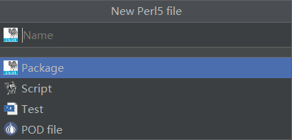
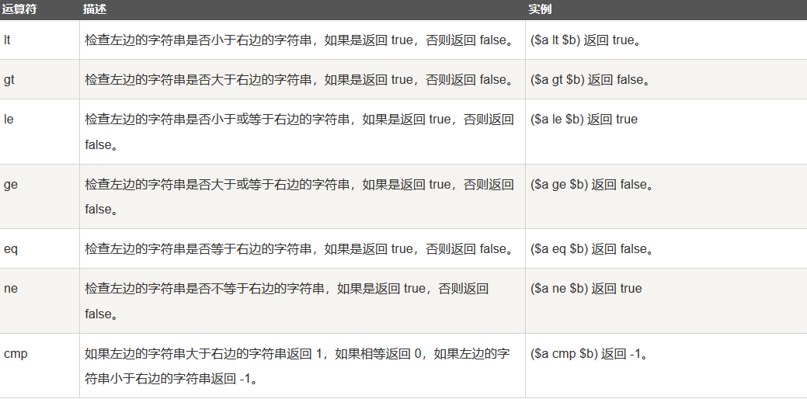

# Perl从入门到放弃

## Perl相关下载安装

- [StrawberryPerl下载](http://strawberryperl.com)
- [IDEA插件Ruby](https://plugins.jetbrains.com/plugin/1293-ruby)

## Perl数据类型
Perl是一种弱类型语言，不需要定义类型，而其基本类型有：标量、数组、哈希。
- 标量：`$num = 123`
- 数组：`@arr = (1, 2, 3)`
- 哈希：`%hash = ('a'=>1,'b'=>2, 'c'=>3)`

## Perl选择语句
- `if...elsif...else...` => 注意`elsif`不是`else if`或者`elif`
- `switch...case`的case语句要用大括号{}
- `unless`的语义与`if`是反的 => 有`unless...elsif...else`语句

## Perl循环语句
- `while`、`do...while`、`until`、`for` 循环都算挺正常的，until与while拥有相反的语义。
- foreach循环语法比较特殊

## Perl运算符
- 幂乘`**`
- 比较运算符`<=>`的作用：检查两个操作数的值是否相等，如果左边的数小于右边的数返回-1，如果相等返回0，如果左边的数大于右边的数返回1。
- 逻辑运算符为：`and`、`or`、`not`、`&&`、`||` 懂的都懂好吧……
- Perl特殊运算符如下：

# Perl学习暂停...
Perl这语言暂时用不到，语法也怪怪的，以后闲的没事儿再说吧。 
